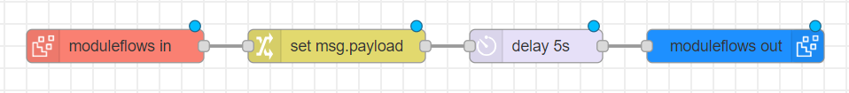

# @gbl-sasm-alert/node-red-contrib-moduleflows

This module provides several nodes that can **easily customize** a flow by **modularizing the flow** and making it easy to **change the properties of nodes** in the flow.

## Description

Using the **moduleflows** module, you can divide flows into modular units, making it easy to manage and reuse them. The moduleflows offers three key functionalities

1. **Modularization** : It allows you to break down your flows into smaller, self-contained modules, making it easier to manage and understand complex workflows. You can determine which property to use within the “moduleflows in” node, and you have the flexibility to modify and apply that property within the "moduleflows" node.




1. **Reuse** : You can reuse these modules by module across different projects or within the same project, promoting code reusability and reducing development time. The "Reuse" feature in the current version of "moduleflows" allows you to save your modules locally and load them for reuse within your Node-RED projects.


3. **Isolation** : moduleflows module have the capability to conceal the underlying logic of moduleflows in and moduleflows out nodes, allowing you to exclusively manipulate the properties within the "moduleflows" node. This enables you to create the desired flow by simply modifying the properties of the "moduleflows" node without exposing the inner workings of the associated modules


---


## Pre-requisites

The `@gbl-sasm-alert/node-red-config-moduleflows` requires [Node-RED](https://nodered.org/) to be installed.

---

## Install

```bash
cd ~/.node-red/
npm install @gbl-sasm-alert/node-red-config-moduleflows
```

Restart your Node-RED instance and you should have nodes available in the palette.

---

## Nodes

- **moduleflows in** : This node is the starting point for "moduleflows," allowing you to provide the name and description of the module. Additionally, you can choose specific node properties within this flow that you wish to customize and provide descriptions for them.


- **moduleflows out** : This node is the end of the “moduleflows”.


- **submoduleflows** : This node is the start of the “subflow”, allowing you to provide the name and description of the submodule. This node allows for the execution of a portion of the logic within the “moduleflows”.


- **moduleflows** : This node allows you to select and reuse the flow between "module in" and "module out" as a single module. Additionally, you can customize the properties of nodes within "moduleflows" from this node.


---

## Management Tools

### moduleflows in current tab


This tool can manage the moduleflows in the currently open tab of the nodeRED workspace.


**① show/hide button**: It allows to visually hide or show the selected moduleflows in the nodeRED workspace.

**② jump to `moduleflows in` node link button**: It shows the position of the moduleflows in node of the selected moduleflow.

**③ jump to `submoduleflows` node link button**: It shows the position of the submoduleflows node of the selected submoduleflow.

**④ save in local button**: It allows to save the selected moduleflow in local storage. The moduleflows will be stored in the following subdirectory of your Node-RED path: `/utils/<moduleflow name>`.

### moduleflows in your local


This tool can manage the moduleflows in the local directory. You can use the moduleflows in the local directory whenever, wherever you want via this tool.


**① search bar**: It allows to search moduleflows in local directory by name and description.

**② delete button**: It allows to delete the selected moduleflows not only in the management tool but also in local directory.

**③ moduleflows container**: When you drag and drop the moduleflow container into the nodeRED workspace, the nodes and links of moduleflows are immediately created.

**④ open local directory button**: It allows to open file explorer/finder/etc where the moduleflows are stored. If you place the moduleflow files here, they can be managed from this management tool.

---

## **ModuleFlows Usage Guide**

**1. Wrapping Logic with moduleFlows:**

- To create a module, you'll need to wrap your desired flow logic with **moduleflows in** and **moduleflows out** nodes. These nodes act as entry and exit points for your module.
- Place the **moduleflows in** node at the beginning of your logic and the **moduleflows out** node at the end.


**2. Specifying Properties in moduleflows in:**

- Inside the **moduleflows in** node, you can specify which properties you want to expose and make editable when reusing the module.
- Use the "Edit Properties" feature in the node's configuration to define the properties you want to make available.


3**. Modifying Properties in moduleflows:**

- The **moduleflows** node serves as the central point for managing your module's properties.
- To reuse the module, simply add a **moduleflows** node to your flow where you want to use it.
- Configure the **moduleflows** node to match the properties you exposed in the **moduleflows in** node.
- You can now modify these properties within the **moduleflows** node to adapt the module's behavior to your specific needs.
- You can conceal the underlying logic of **moduleflows in** and **moduleflows out** nodes by **ModuleFlows in Current Tab**


**4. Saving and Reusing moduleflows:**

- Use the moduleflows manage tab within Node-RED to save your modules for future use.
- To save a module:
  - Select the **ModuleFlows in Current Tab**.
  - Locate the module you want to save and click **Save in Local**.
- To reuse a saved module:
  - Drag a **moduleflows** at tab into your flow.
  - In the ModuleFlows in Your Local you can choose the saved module from the list.
  - Configure the node's properties as needed.


---

## Discussions and suggestions

Use GitHub Issues to ask questions or to discuss new features.

---

## Authors

**[GBL-SASM-ALERT](https://github.com/GBL-SASM-Alert)** in SSAFY(Samsung Software Academy for Youth) 9th

- [Yoo Chang Jae](https://github.com/zzangjae)
- [Jung Eun Kyung](https://github.com/f1rstf1y9)
- [Kim Seung Yeon](https://github.com/ksy00826)
- [Kim Sung Hyun](https://github.com/Sunghyun1320)
- [Oh Ju Young](https://github.com/Jy0923)

---

## Copyright and license

Copyright Samsung Automation Studio Team under the [Apache 2.0 license](https://www.apache.org/licenses/LICENSE-2.0)

---

## Reference

- [Node-RED Documentation](https://nodered.org/docs/)
- [Node-RED node-red-contrib-actionflows](https://flows.nodered.org/node/node-red-contrib-actionflows)
- [Node-RED node-red-contrib-reusable-flows](https://flows.nodered.org/node/node-red-contrib-reusable-flows)
- [Node-RED node-red-contrib-flow-manager](https://flows.nodered.org/node/node-red-contrib-flow-manager)
- [SamsungAutomationStudio Github Repository](https://github.com/Samsung/SamsungAutomationStudio)
  ***
